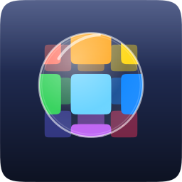
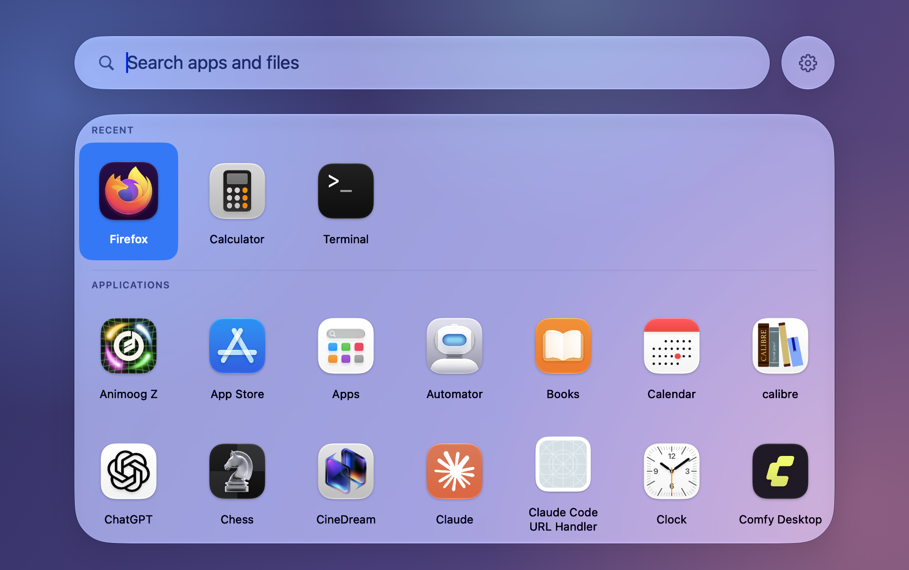
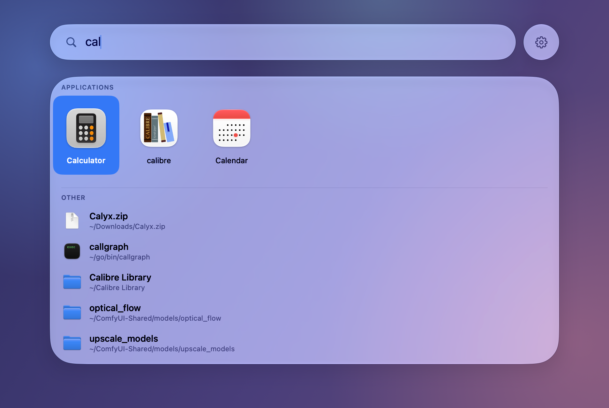
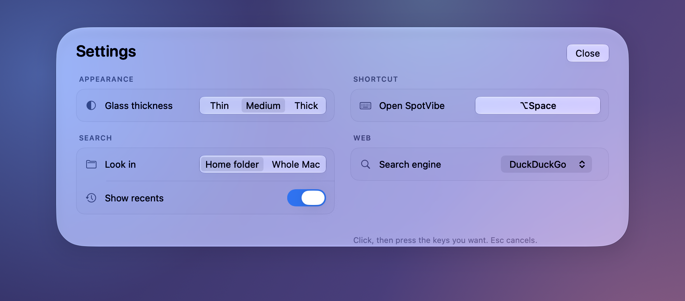

<div align="center">



# SpotVibe

**A Spotlight replacement for macOS 26 that opens your apps, not the internet.**

[](#install)
[](https://swift.org)
[](LICENSE)

Press `⌥Space`. Your apps are already on screen, arranged like the Dock's Apps grid,
with the ones you actually use first. Type three letters and the one you meant is
selected. Press `Return`. Nothing was uploaded, nothing was suggested, nothing was
sponsored.



</div>

## Why

Spotlight stopped being a launcher. It searches the web, suggests things nobody asked
for, ranks a definition above the app you open six times a day, and makes you wait for
a network round trip to do it.

SpotVibe does one job: open what is already on your Mac.

- **It never searches the internet.** The only request it can make is the one you ask
  for by name, and it hands that to your default browser rather than fetching anything
  itself. There is no analytics, no telemetry, no account.
- **It learns your hands, not your habits in aggregate.** Every launch teaches every
  prefix you typed to get there, locally, in one JSON file you can read and delete.
- **It looks like the OS it runs on.** Real Liquid Glass — `glassEffect`,
  `GlassEffectContainer`, morph transitions — not a blurred rectangle pretending.

## Install

Requires **macOS 26 (Tahoe) or later** and the macOS 26 SDK. Apple Silicon and Intel.

```bash
git clone https://github.com/NicoNex/Spotvibe.git
cd Spotvibe
make app && cp -R dist/SpotVibe.app /Applications/
open /Applications/SpotVibe.app
```

`make dmg` builds a distributable disk image instead. The app is ad-hoc signed: to hand
it to someone else, swap in a Developer ID in the `Makefile`.

It builds with the **Command Line Tools alone — no Xcode required**, at the cost of two
hand-written property-wrapper expansions in `RootView.swift`, because the SwiftUI macro
plugin ships only with Xcode.

## Use

| Key | What it does |
| --- | --- |
| `⌥Space` | Open or dismiss the panel (rebindable) |
| Type | Filter apps, then files, live |
| `← → ↑ ↓` | Move through the grid and the list |
| `Return` | Open the selection |
| `Esc` | Leave settings, or close the panel |

An empty field shows every app: your most-used first under **Recent**, then
**Applications**, then **Other** — where macOS puts its utilities, the same place
Spotlight files them. Type, and the split disappears: everything competes on merit, with
matching files listed under the apps.

The last row always offers to hand the query to your browser, so searching the web stays
one keystroke away and never happens by accident.



## Settings

The gear beside the search bar grows into the settings — one piece of glass, no second
window.



- **Glass thickness** — thin, medium or thick, for how much of your desktop shows through.
- **Shortcut** — click and press any chord. Pressing the one already bound keeps it.
- **Look in** — your home folder, or the whole Mac.
- **Show recents** — the first row, on or off.
- **Search engine** — DuckDuckGo, Google, Bing or Ecosia, for the web row only.

## How it works

- **Apps** come from a directory listing of `/Applications`, `/System/Applications` and
  `~/Applications`, read once at launch and filtered in memory — so they appear on the
  same keystroke that typed them. Names are the localized ones: *Calcolatrice*, not
  *Calculator*, if that is your system language.
- **Files** come from Spotlight's own index through `NSMetadataQuery`, debounced by
  120 ms. No second index is built, none is maintained, nothing crawls your disk at 3am.
- **Ranking is frecency.** Every launch adds 1 to a score that halves every 30 days,
  recorded against *every prefix* of what you typed. Open Firefox after typing `fire`
  and it teaches `f`, `fi`, `fir` and `fire` — so next time the first keystroke already
  puts it on top. It lives in
  `~/Library/Application Support/SpotVibe/frecency.json`.
- **The hotkey is Carbon's `RegisterEventHotKey`**, still the only system-wide hotkey API
  that needs **no Accessibility permission**. SpotVibe asks for nothing at install.
- **Appearance follows System Settings**: the glass takes your accent colour and the
  system glass-tint amount, Reduce Transparency swaps it for a solid window background,
  and Reduce Motion drops the entrance spring.

## Built with

Swift 6 · SwiftUI · AppKit `NSPanel` · Liquid Glass (`glassEffect`,
`GlassEffectContainer`, `glassEffectID`, `glassEffectUnion`) · `NSMetadataQuery` ·
Carbon hotkeys · Swift Package Manager · swift-testing

Useful to read if you are adopting Liquid Glass yourself: `RootView.swift` is a
worked example of morphing one glass element into another without ever adding or
removing one mid-animation — which, as the comments explain, leaves it
un-hit-testable.

## Develop

```bash
make run          # debug build, launched in the foreground with query timings
make run DEMO=cal # ...with a term already typed
make test         # swift-testing suite
make icon         # redraw the icon from Tools/icon.py (needs librsvg)
make screenshots  # regenerate the images in this README
```

`make screenshots` puts a neutral backdrop behind the panel first, so shots are
reproducible and carry nothing from your desktop.

## FAQ

**Is this a Raycast or Alfred alternative?**
Only if what you want from them is a launcher. SpotVibe has no extensions, no clipboard
history, no window manager, no AI. It opens apps and files, fast, and stops there.

**Does it replace the Apps icon in the Dock?**
That is what the icon was drawn for. Drag `SpotVibe.app` to the Dock and it sits in that
slot; the app itself runs as a menu-bar agent with no Dock icon of its own.

**Does it need Accessibility or Full Disk Access?**
No. The global hotkey uses the one API that does not prompt, and file results come from
the Spotlight index the system already maintains.

**Does it send anything anywhere?**
No. There is no networking code in it at all. The web row opens a URL in your browser;
that is the only way a byte leaves.

**What if `⌥Space` is already taken?**
The menu-bar item says so, and the settings let you record any other chord. Alfred,
Raycast and input-source switchers commonly hold that one.

**Why macOS 26 only?**
Liquid Glass is the whole visual design, and those APIs are new in 26. There is no
fallback path, by choice.

## License

[GNU General Public License v3](LICENSE). Use it, read it, change it, share it. If you
distribute a changed version — source or binary — that version has to be free software
too, under the same licence, with its source available. That is the whole deal.

The `.app` carries the licence text in `Contents/Resources/LICENSE`, so a copy travels
with every build.

## Contributing

Issues and pull requests are welcome. `make test` should pass, and the code is commented
in the style of the existing files: explain *why*, especially where something looks
strange, because usually it is load-bearing.
